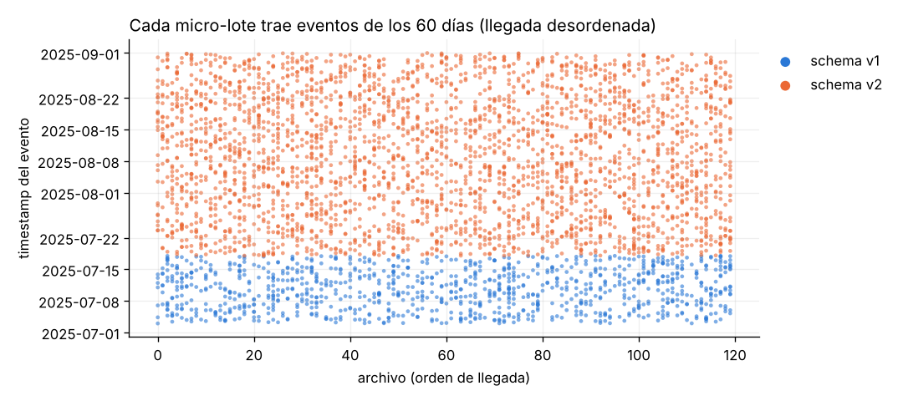
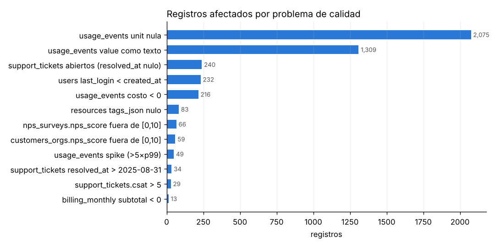
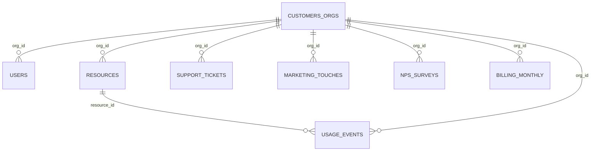
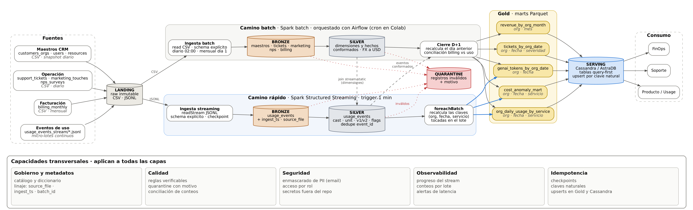
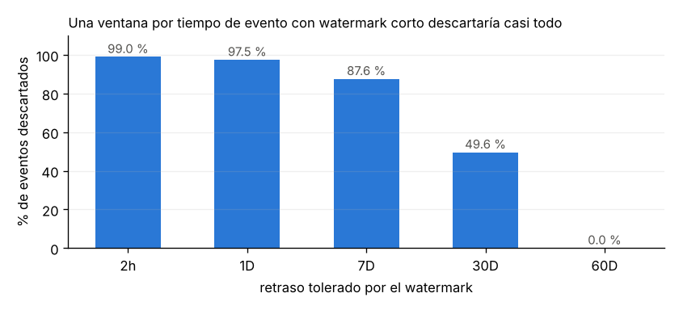

# Cloud Provider Analytics — Documento de diseño · Entrega 1

**Materia:** Minería de Datos II · ISTEA 2C 2026
**Autor:** Sebastián
**Versión:** v0.3 (secciones 1 a 4)

---

## 1. Comprensión del problema

### 1.1 Contexto

El área de datos de un proveedor de nube tiene que **ingestar, limpiar, conformar y publicar** datos de clientes para tres equipos: FinOps, Soporte y Producto. Esto exige dos capacidades:

- **Near real-time** para los eventos de uso y el costo incremental (`usage_events_stream/*.jsonl`).
- **Batch diario o mensual** para los maestros (orgs, usuarios, recursos), la facturación, los tickets, el marketing y el NPS.

Los datos llegan crudos: tienen nulos, números como texto, costos negativos, picos y un cambio de esquema a mitad del período (v2 desde el 18/07/2025).

### 1.2 Usuarios, preguntas y decisiones

| Usuario | Preguntas principales | Decisión que habilita | Fuentes |
|---|---|---|---|
| **FinOps** | ¿Cuánto gasta cada org por servicio y por día? ¿Qué costos son anómalos (negativos, picos)? ¿Coincide el uso medido con lo facturado? ¿Cuánto pesan los créditos, los impuestos y la moneda? | Alertar sobrecostos, auditar la facturación, ajustar créditos | usage_events, billing_monthly, customers_orgs, resources |
| **Soporte** | ¿Qué orgs concentran tickets críticos? ¿Qué % incumple el SLA? ¿Cómo evoluciona el CSAT por org y fecha? ¿Los tickets coinciden con anomalías de uso? | Priorizar cuentas, reforzar guardias, detectar clientes en riesgo | support_tickets, customers_orgs, usage_events |
| **Producto / Usage** | ¿Qué servicios y regiones crecen? ¿Cómo se adopta GenAI (tokens)? ¿Cuánto carbono genera cada servicio? ¿El uso se relaciona con el NPS y las conversiones? | Roadmap, pricing de GenAI, reportes de sostenibilidad | usage_events, resources, nps_surveys, marketing_touches, users |

### 1.3 Objetivos medibles (criterios de éxito)

| ID | Objetivo | Métrica | Meta | Usuario |
|---|---|---|---|---|
| O1 | Frescura del uso | Latencia entre la llegada a Landing y la disponibilidad en el mart de uso | ≤ 15 min | FinOps, Producto |
| O2 | Costo diario consolidado | Mart `org_daily_usage_by_service` (org × día × servicio) completo | D+1 antes de las 06:00 | FinOps |
| O3 | Sin pérdida de registros | Filas en Landing = filas en Bronze = filas en Silver + filas en Quarantine | 100 % conciliado | Todos |
| O4 | Compatibilidad de esquema | Eventos v1 y v2 en un esquema unificado (`carbon_kg` y `genai_tokens` nulos en v1) | 100 % | Producto |
| O5 | Detección de anomalías | Costos negativos y picos marcados con un flag y su motivo | 100 % detectados (en la muestra: 216 negativos y 49 picos) | FinOps |
| O6 | Idempotencia | Duplicados de `event_id` después de un reproceso | 0 | Todos |
| O7 | Indicadores de soporte | Tickets, % de SLA incumplido y CSAT promedio por org y día | D+1 | Soporte |
| O8 | Conciliación de facturación | Diferencia entre el costo de los eventos y el subtotal facturado, por org y mes (jul–ago) | Reportada para el 100 % de las orgs | FinOps |

### 1.4 Alcance de esta entrega

- **Incluye:** el diseño de la arquitectura, el Data Lake, los flujos, el MapReduce, los riesgos, el plan y la exploración inicial del dataset.
- **No incluye (entregas posteriores):** la implementación completa en Spark, la carga en Cassandra/AstraDB y el modelo de ML.

---

## 2. Justificación Big Data (5V)

Las 5V no se usan como checklist, sino para justificar las decisiones del diseño. La evidencia sale del perfilado de la muestra provista y se reproduce en [`notebooks/02_cifras_5v_y_arquitectura.ipynb`](../notebooks/02_cifras_5v_y_arquitectura.ipynb). La escala proyectada es un **supuesto** de un proveedor real.

| V | Evidencia en el dataset | Escala proyectada (supuesto) | Decisión de diseño que provoca | Peso |
|---|---|---|---|---|
| **Velocidad** | Los eventos llegan en **120 micro-lotes** de 360 eventos. **Cada archivo mezcla eventos de los 60 días** (del 03/07 al 31/08), es decir, llegan desordenados y tarde. | Medición continua cada pocos minutos por recurso | Structured Streaming con **watermark**, deduplicación por `event_id` y checkpointing. Partición por **fecha del evento**, no por fecha de llegada. | **Alta** |
| **Veracidad** | 1.309 `value` como texto · 877 `value` nulos · 2.075 `unit` nulas · **216 costos negativos** · **49 picos** (> 5 × p99, máximo 317 USD frente a una mediana de 1 USD) · 13 subtotales de billing negativos · facturas en ARS con subtotales de la misma magnitud que en USD (convertidos darían alrededor de 1 USD) · NPS fuera de escala (−38 a 101) · CSAT de 6 y 7 · 232 usuarios con `last_login` anterior a `created_at` | Se mantiene o crece con más fuentes | Reglas de calidad verificables, **quarantine**, casteo con fallback, `unit` inferida desde `metric`, flags de anomalía (se marcan, no se borran) | **Alta** |
| **Variedad** | 7 CSV y JSONL · **2 versiones de esquema** (v2 agrega `carbon_kg` y, en genai, `genai_tokens`) · 3 monedas · JSON embebido en CSV (`tags_json`) · texto libre (`comment`) | Más servicios, métricas y versiones | Esquemas explícitos por fuente, esquema unificado v1/v2 en Silver, normalización de monedas a USD | Media |
| **Volumen** | Muestra chica: 43.200 eventos (~13 MB, ~300 B/evento), 80 orgs, 400 recursos | 500 mil recursos × 3 métricas × 1 evento cada 5 min ≈ **432 M eventos/día ≈ 130 GB/día en JSON (~4 TB/mes)** | Almacenamiento distribuido, Parquet columnar comprimido, particionado y procesamiento paralelo (Spark/MapReduce). El diseño tiene que escalar sin cambiar la arquitectura. | Media |
| **Valor** | ~147 mil USD de costo en 60 días · los picos son el **6,3 % del costo** (9,3 mil USD en 49 eventos) · GenAI es el 9,6 % de los eventos pero el **20 % del costo** · 9,5 % de los tickets incumple el SLA y el 24 % sigue abierto | Proporcional a la facturación | Marts orientados a cada usuario, con alertas tempranas de costo y KPIs de soporte y adopción | Alta |

### 2.1 V dominantes

- **Velocidad y veracidad** son las que definen la arquitectura.
  - Los eventos desordenados y tardíos obligan a tener una capa de streaming con watermark e idempotencia.
  - La mala calidad de los datos obliga a separar las zonas Bronze y Silver, con quarantine y reglas explícitas.
- **La variedad** explica por qué Silver tiene que unificar los esquemas v1/v2 y las monedas.
- **El volumen** de la muestra no justifica Big Data por sí mismo. Lo justifica la **escala real proyectada**: el diseño se prueba con la muestra y escala horizontalmente sin rediseño.
- **El valor** está concentrado. Pocos eventos (los picos) y un servicio (GenAI) explican una parte desproporcionada del costo, y eso justifica el mart diario y las alertas.

---

## 3. Inventario y perfil de fuentes

La evidencia está en [`notebooks/01_exploracion_landing.ipynb`](../notebooks/01_exploracion_landing.ipynb). Las salidas se guardan en [`evidence/`](../evidence/).

### 3.1 Inventario

| Fuente | Dominio | Grano | Clave | Llegada / frecuencia | Filas | Período | Ingesta |
|---|---|---|---|---|---|---|---|
| `customers_orgs.csv` | Maestro (CRM) | 1 fila por org | `org_id` | Snapshot diario | 80 | altas 04/05–02/07/2025 | Batch |
| `users.csv` | Maestro | 1 fila por usuario | `user_id` | Snapshot diario | 800 | 04/05–31/08 | Batch |
| `resources.csv` | Maestro / inventario | 1 fila por recurso | `resource_id` | Snapshot diario | 400 | 04/05–21/08 | Batch |
| `support_tickets.csv` | Soporte | 1 fila por ticket | `ticket_id` | Diario (incremental) | 1.000 | 09/05–31/08 | Batch |
| `marketing_touches.csv` | Marketing | 1 fila por contacto | `touch_id` | Diario (incremental) | 1.500 | 04/05–31/08 | Batch |
| `nps_surveys.csv` | Producto | 1 fila por encuesta (varias por org) | `org_id` + `survey_date` | Eventual | 92 | 24/05–31/08 | Batch |
| `billing_monthly.csv` | FinOps | org × mes | `invoice_id` | Mensual | 240 (80 × 3) | jun, jul, ago 2025 | Batch |
| `usage_events_stream/*.jsonl` | Uso / costo | 1 fila por evento | `event_id` | **Continua, 120 micro-lotes de 360 eventos** | 43.200 | 03/07–31/08 (60 días) | **Streaming** |

Las frecuencias de los maestros son un **supuesto** de operación; el dataset trae un único corte.

### 3.2 Esquema y tipos

| Fuente | Columnas (tipo destino) | Observaciones |
|---|---|---|
| customers_orgs | org_id `string` · org_name · industry · hq_region · plan_tier · is_enterprise `bool` · signup_date `date` · sales_rep · lifecycle_stage · marketing_source · nps_score `double` | 10 industrias, 7 regiones, 4 planes, 5 etapas |
| users | user_id · org_id · email · role · active `bool` · created_at `date` · last_login `date` | `email` es **dato personal** (PII) |
| resources | resource_id · org_id · service · region · created_at `date` · state · tags_json `array<string>` | JSON embebido en CSV; tag `pii:true` |
| support_tickets | ticket_id · org_id · category · severity · created_at `date` · resolved_at `date` · csat `double` · sla_breached `bool` | `resolved_at` nulo = ticket abierto |
| marketing_touches | touch_id · org_id · campaign · channel · timestamp `date` · clicked `bool` · converted `bool` | Sin nulos |
| nps_surveys | org_id · survey_date `date` · nps_score `double` · comment `string` | Texto libre |
| billing_monthly | invoice_id · org_id · month `date` · subtotal · credits · taxes · exchange_rate_to_usd `double` · currency | 3 monedas: USD, ARS, EUR |
| usage_events | event_id · timestamp `timestamp` · org_id · resource_id · service · region · metric · value `double` · unit · cost_usd_increment `double` · schema_version `int` · carbon_kg `double` (v2) · genai_tokens `long` (v2, solo genai) | Ver §3.3 |

### 3.3 Hallazgos del stream de eventos

- **Llegada desordenada:** cada micro-lote contiene eventos de los 60 días. El orden de llegada no sirve para particionar ni para calcular ventanas, así que se usa la fecha del evento.
- **Evolución de esquema:** v1 llega hasta el 17/07 (10.800 eventos) y v2 empieza el 18/07 (32.400). `carbon_kg` está en el 100 % de v2. `genai_tokens` aparece solo en el servicio genai con v2.
- **`metric` determina `unit`:** cpu_hours→hours, requests→count, storage_gb_hours→gb_hours. Eso permite completar las 2.075 `unit` nulas.
- **`metric` no depende de `service`:** todas las combinaciones existen; por ejemplo, networking reporta `cpu_hours`.
- **Sin duplicados:** `event_id` es único en la muestra, pero se deduplica igual porque un reproceso los generaría.

### 3.4 Perfil de calidad

| Fuente | Problema | Registros | % | Tratamiento propuesto | Zona |
|---|---|---|---|---|---|
| usage_events | `value` llega como texto | 1.309 | 3,0 % | Cast a `double` con fallback a nulo; se cuentan las fallas | Bronze → Silver |
| usage_events | `value` nulo | 877 | 2,0 % | Se conserva nulo; no se imputa | Silver |
| usage_events | `unit` nula | 2.075 | 4,8 % | Se infiere desde `metric` | Silver |
| usage_events | `cost_usd_increment` < 0 | 216 | 0,5 % | `flag_negative_cost`; se trata como ajuste/crédito, no se borra | Silver |
| usage_events | Spike (> 5 × p99) | 49 | 0,1 % | `flag_spike` (se suma z-score/MAD en la entrega 2); son el 6,3 % del costo | Silver |
| usage_events | Columnas v2 ausentes en v1 | 10.800 | 25 % | Esquema unificado con nulos explícitos | Silver |
| billing_monthly | Subtotal negativo | 13 | 5,4 % | Flag y revisión; se excluye de KPIs de revenue | Silver |
| billing_monthly | `credits` nulo | 137 | 57 % | Nulo = 0 crédito (supuesto) | Silver |
| billing_monthly | Facturas USD con tipo de cambio ≠ 1 (0,85–1,12) | 160 | 67 % | Forzar tc = 1 para USD; decisión abierta | Silver |
| billing_monthly | ARS con subtotal de magnitud USD (mediana 816; × tc ≈ 1,2 USD) | 51 | 21 % | **Decisión abierta:** subtotal ya en USD o tc mal informado | Silver |
| customers_orgs | `nps_score` fuera de [0, 10] (−38 a 101) | 59 | 74 % | Se trata como "NPS de cuenta" (−100 a 100) o se descarta; decisión abierta | Silver |
| nps_surveys | `nps_score` fuera de [0, 10] (−16 a 68) | 66 | 72 % | Igual que la fila anterior | Silver |
| nps_surveys | `nps_score` nulo | 19 | 21 % | Se excluye del promedio | Silver |
| support_tickets | `csat` > 5 (6 y 7) | 29 | 2,9 % | Quarantine de la métrica (fuera de escala 1–5) | Silver |
| support_tickets | `csat` nulo | 254 | 25 % | Se excluye del promedio | Silver |
| support_tickets | `resolved_at` posterior al fin del dataset (hasta 19/09) | 34 | 3,4 % | Se acepta (resolución tardía); se documenta | Silver |
| users | `last_login` < `created_at` | 232 | 29 % | Flag de incoherencia; `last_login` no se usa para antigüedad | Silver |
| users | `last_login` nulo | 139 | 17 % | Usuario sin login | Silver |
| resources | `tags_json` nulo | 83 | 21 % | Array vacío | Silver |

### 3.5 Trazabilidad e integridad

- **Integridad referencial completa:** no hay `org_id` ni `resource_id` huérfanos en ninguna fuente. Además, el org, el servicio y la región de cada evento coinciden con los de su recurso. Por eso los joins con dimensiones no pierden filas.
- **Linaje por registro:** Bronze agrega `source_file`, `ingest_ts` y `batch_id`, de modo que cada fila de Silver o Gold se puede rastrear hasta su archivo en Landing.
- **Conciliación de conteos:** filas en Landing = filas en Bronze = filas en Silver + filas en Quarantine (objetivo O3).
- **Datos sensibles:** `users.email` y los recursos con tag `pii:true` se enmascaran antes de Gold.

### 3.6 Riesgos de datos (detalle en §10)

| Riesgo | Impacto |
|---|---|
| Billing y eventos se solapan solo en jul–ago (los eventos empiezan el 03/07) | Junio no se puede conciliar (O8 limitado a jul–ago) |
| Moneda y tipo de cambio inconsistentes | Revenue en USD potencialmente erróneo |
| Escala de NPS ambigua | KPIs de satisfacción no comparables |
| Eventos tardíos fuera del watermark | Costo diario subestimado si no se reprocesa |
| Nuevas versiones de esquema (v3) | Fallas de ingesta si el esquema no es evolutivo |

---

## 4. Arquitectura de alto nivel (v1)

Fuente editable: [`arquitectura_v1.dot`](arquitectura_v1.dot). Para regenerar la imagen: `python docs/build_diagrama.py`.

### 4.1 Cómo se lee

La cadena es la de la consigna: **fuentes → ingesta → Data Lake → procesamiento → serving → consumo**, con capacidades transversales. Todo aterriza primero en **Landing**, que es inmutable, y desde ahí hay dos caminos:

- **Camino rápido (streaming):** los eventos de uso pasan por Bronze y Silver cada minuto y actualizan los marts de uso, anomalías y GenAI. Cubre el objetivo O1 (frescura ≤ 15 min).
- **Camino batch:** los maestros, tickets, marketing, NPS y facturación se cargan una vez por día (billing una vez por mes). El **cierre D+1** recalcula el día anterior completo y concilia el uso contra la facturación. Cubre O2, O7 y O8.

Los dos caminos escriben en las mismas zonas y en los mismos marts de Gold. Cassandra/AstraDB sirve esos marts a los tres equipos.

### 4.2 Componentes

| Capa | Componente | Herramienta | Responsabilidad | Entrada → salida | Objetivos |
|---|---|---|---|---|---|
| Fuentes | Maestros, operación, facturación, eventos | CSV, JSONL | Datos crudos del negocio | — → Landing | — |
| Data Lake | Landing | Sistema de archivos (Google Drive en Colab) | Guardar los originales sin tocar; base de cualquier reproceso | Fuentes → Landing | O3 |
| Ingesta batch | Job de carga | PySpark batch, orquestado con Airflow (cron o ejecución manual en Colab) | Leer CSV con esquema explícito, agregar `ingest_ts`, `source_file`, `batch_id` | Landing → Bronze | O3 |
| Ingesta streaming | Query de streaming | Spark Structured Streaming (file source, trigger 1 min, checkpoint) | Leer cada micro-lote nuevo una sola vez, con esquema explícito | Landing → Bronze | O1, O6 |
| Procesamiento | Conformado y calidad | PySpark (batch y `foreachBatch`) | Cast con fallback, `unit` desde `metric`, esquema v1/v2, flags de anomalía, FX a USD, dedupe por `event_id`; los inválidos van a quarantine | Bronze → Silver / Quarantine | O3, O4, O5, O6 |
| Procesamiento | Agregación incremental | `foreachBatch` | Recalcular desde Silver las claves `(org, fecha, servicio)` tocadas por el lote | Silver → Gold | O1, O6 |
| Procesamiento | Cierre D+1 | PySpark batch | Recalcular el día anterior completo, armar los marts batch y conciliar billing contra uso | Silver → Gold | O2, O7, O8 |
| Data Lake | Gold | Parquet | 5 marts con grano fijo (ver diagrama) | — | Todos |
| Serving | Keyspace analítico | Cassandra / AstraDB, cargado con spark-cassandra-connector | Tablas query-first, upsert por clave natural | Gold → tablas | O1, O2, O6 |
| Consumo | Dashboards y consultas | Herramienta de visualización conectada a AstraDB | Responder las preguntas de §1.2 | Tablas → usuarios | — |
| Transversal | Gobierno, calidad, seguridad, observabilidad, idempotencia | Diccionario en el repo, columnas de linaje, `StreamingQueryProgress`, logs de conteo | Ver la banda inferior del diagrama | — | O3, O6 |

### 4.3 Decisiones que salen de los datos

**No se agrega con ventanas por tiempo de evento dentro del stream.** Cada micro-lote trae eventos de los 60 días (§3.3). Simulando la llegada de los 120 archivos en orden, un watermark típico descartaría casi todo:

| Retraso tolerado por el watermark | 2 h | 1 día | 7 días | 30 días | 60 días |
|---|---|---|---|---|---|
| % de eventos descartados | 99,0 % | 97,5 % | 87,6 % | 49,6 % | 0 % |

Por eso el diseño es este:

1. **Bronze y Silver en modo append**, sin descartar eventos tardíos. Ningún evento se pierde por llegar tarde.
2. **El watermark solo acota el estado de la deduplicación** por `event_id`. Se define sobre `ingest_ts` (hora de llegada), porque un reintento del productor llega cerca en el tiempo de su original.
3. **`foreachBatch` recalcula las claves afectadas.** Toma las combinaciones `(org_id, event_date, service)` presentes en el lote, las recalcula desde Silver y hace upsert en Gold y en Cassandra. Así el resultado es correcto aunque un evento llegue con semanas de atraso, y reprocesar un lote no duplica valores.
4. **El cierre D+1 funciona como control.** Recalcula el día anterior completo y compara contra lo que produjo el camino rápido.

**Las dimensiones se unen al stream como tablas estáticas** (*stream-static join*). Los maestros cambian una vez por día y los eventos cada minuto, así que el stream lee la última versión de Silver.

**Hay una sola quarantine para los dos caminos.** Tiene el mismo formato y guarda la columna `motivo`, lo que permite conciliar `Landing = Bronze = Silver + Quarantine` (O3).

### 4.4 Latencia esperada por camino

| Camino | Frecuencia | Latencia objetivo | Marts que actualiza |
|---|---|---|---|
| Rápido (streaming) | Trigger cada 1 min | ≤ 15 min desde la llegada a Landing | org_daily_usage_by_service, cost_anomaly_mart, genai_tokens_by_org_date |
| Batch diario | 02:00 | D+1 antes de las 06:00 | Los 5 marts (recalcula el día anterior) |
| Batch mensual | Día 1 del mes | D+1 | revenue_by_org_month y conciliación de billing |

### 4.5 Entorno de ejecución

- **Académico (entregas 2 y final):** Google Colab con PySpark en modo local. Parquet en Google Drive y AstraDB como serving gestionado. La orquestación se resuelve con un notebook o script que corre los jobs en orden.
- **Referencia de producción:** el mismo código sobre un cluster Spark, almacenamiento de objetos (S3/GCS/ADLS) y Airflow para el batch. El diseño no cambia, solo la infraestructura.

El patrón elegido (streaming para eventos más batch para maestros y cierre diario) se justifica contra Lambda y Kappa en §5.
