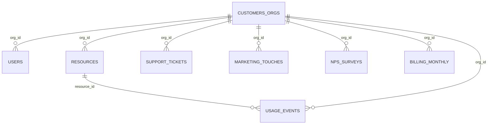

# Cloud Provider Analytics — Documento de diseño · Entrega 1

**Materia:** Minería de Datos II · ISTEA 2C 2026
**Autor:** Sebastián

---

## 1. Comprensión del problema

### 1.1 Contexto

El área de datos de un proveedor de nube tiene que **ingestar, limpiar, conformar y publicar** datos de clientes para tres equipos: FinOps, Soporte y Producto. Esto exige dos capacidades:

- **Near real-time** para los eventos de uso y el costo incremental (`usage_events_stream/*.jsonl`).
- **Batch diario o mensual** para los maestros (orgs, usuarios, recursos), la facturación, los tickets, el marketing y el NPS.

Los datos llegan crudos: tienen nulos, números como texto, costos negativos, picos y un cambio de esquema a mitad del período (v2 desde el 18/07/2025).

### 1.2 Usuarios, preguntas y decisiones

| Usuario | Preguntas principales | Decisión que habilita | Fuentes |
|---|---|---|---|
| **FinOps** | ¿Cuánto gasta cada org por servicio y por día? ¿Qué costos son anómalos (negativos, picos)? ¿Coincide el uso medido con lo facturado? ¿Cuánto pesan los créditos, los impuestos y la moneda? | Alertar sobrecostos, auditar la facturación, ajustar créditos | usage_events, billing_monthly, customers_orgs, resources |
| **Soporte** | ¿Qué orgs concentran tickets críticos? ¿Qué % incumple el SLA? ¿Cómo evoluciona el CSAT por org y fecha? ¿Los tickets coinciden con anomalías de uso? | Priorizar cuentas, reforzar guardias, detectar clientes en riesgo | support_tickets, customers_orgs, usage_events |
| **Producto / Usage** | ¿Qué servicios y regiones crecen? ¿Cómo se adopta GenAI (tokens)? ¿Cuánto carbono genera cada servicio? ¿El uso se relaciona con el NPS y las conversiones? | Roadmap, pricing de GenAI, reportes de sostenibilidad | usage_events, resources, nps_surveys, marketing_touches, users |

### 1.3 Objetivos medibles (criterios de éxito)

| ID | Objetivo | Métrica | Meta | Usuario |
|---|---|---|---|---|
| O1 | Frescura del uso | Latencia entre la llegada a Landing y la disponibilidad en el mart de uso | ≤ 15 min | FinOps, Producto |
| O2 | Costo diario consolidado | Mart `org_daily_usage_by_service` (org × día × servicio) completo | D+1 antes de las 06:00 | FinOps |
| O3 | Sin pérdida de registros | Filas en Landing = filas en Bronze = filas en Silver + filas en Quarantine | 100 % conciliado | Todos |
| O4 | Compatibilidad de esquema | Eventos v1 y v2 en un esquema unificado (`carbon_kg` y `genai_tokens` nulos en v1) | 100 % | Producto |
| O5 | Detección de anomalías | Costos negativos y picos marcados con un flag y su motivo | 100 % detectados (en la muestra: 216 negativos y 49 picos) | FinOps |
| O6 | Idempotencia | Duplicados de `event_id` después de un reproceso | 0 | Todos |
| O7 | Indicadores de soporte | Tickets, % de SLA incumplido y CSAT promedio por org y día | D+1 | Soporte |
| O8 | Conciliación de facturación | Diferencia entre el costo de los eventos y el subtotal facturado, por org y mes (jul–ago) | Reportada para el 100 % de las orgs | FinOps |

### 1.4 Alcance de esta entrega

- **Incluye:** el diseño de la arquitectura, el Data Lake, los flujos, el MapReduce, los riesgos, el plan y la exploración inicial del dataset.
- **No incluye (entregas posteriores):** la implementación completa en Spark, la carga en Cassandra/AstraDB y el modelo de ML.

---

## 2. Justificación Big Data (5V)

Las 5V no se usan como checklist, sino para justificar las decisiones del diseño. La evidencia sale de `notebooks/02_perfil_de_calidad.ipynb` y `notebooks/03_cifras_5v.ipynb`. La escala proyectada es un **supuesto** de un proveedor real.

| V | Evidencia en el dataset | Escala proyectada (supuesto) | Decisión de diseño que provoca | Peso |
|---|---|---|---|---|
| **Velocidad** | Los eventos llegan en **120 micro-lotes** y **cada archivo trae eventos de los 60 días** (del 03/07 al 31/08): llegan desordenados. | Medición continua cada pocos minutos por recurso | Streaming con deduplicación por `event_id` y checkpoint. Partición por **fecha del evento**, no por fecha de llegada. | **Alta** |
| **Veracidad** | 1.309 `value` como texto · 877 `value` nulos · 2.075 `unit` nulas · **216 costos negativos** · **49 picos** (> 5 × p99) · 13 subtotales negativos · 160 facturas USD con tipo de cambio ≠ 1 · NPS fuera de escala (59 orgs, 66 encuestas) · 29 CSAT > 5 · 232 usuarios con `last_login` anterior a `created_at` | Se mantiene o crece con más fuentes | Reglas de calidad verificables, **quarantine**, conversión de tipos con fallback, `unit` deducida de `metric`, anomalías **marcadas, no borradas** | **Alta** |
| **Variedad** | 7 CSV y JSONL · **2 versiones de esquema** (v2 agrega `carbon_kg` y `genai_tokens`) · 3 monedas · JSON dentro de un CSV (`tags_json`) · texto libre (`comment`) | Más servicios, métricas y versiones | Esquema explícito por fuente, esquema unificado v1/v2 en Silver, normalización de monedas a USD | Media |
| **Volumen** | Muestra chica: 43.200 eventos, 12,9 MB, ~299 bytes/evento, 720 eventos/día | 500 mil recursos × 3 métricas × 1 evento cada 5 min ≈ **432 M eventos/día ≈ 129 GB/día (~3,9 TB/mes)** | Almacenamiento distribuido, Parquet columnar y particionado, procesamiento en paralelo con Spark. El diseño escala sin cambiar la arquitectura. | Media |
| **Valor** | ~147 mil USD de costo en 60 días · los picos son el **6,3 %** del costo en 49 eventos · GenAI es el 9,6 % de los eventos y el **20 %** del costo · 9,5 % de tickets con SLA incumplido y 24 % abiertos | Proporcional a la facturación | Marts por usuario con alertas de costo y KPIs de soporte y adopción | Alta |

### 2.1 V dominantes

- **Velocidad y veracidad** definen la arquitectura. Los eventos desordenados obligan a un streaming que tolere eventos atrasados, y la mala calidad obliga a separar Bronze de Silver con quarantine y reglas explícitas.
- **La variedad** explica por qué Silver unifica los esquemas v1/v2 y las monedas.
- **El volumen** de la muestra no justifica Big Data por sí solo: lo justifica la **escala real proyectada**. El diseño se prueba con la muestra y escala sin rediseño.
- **El valor** está concentrado: pocos eventos (los picos) y un servicio (GenAI) explican una parte desproporcionada del costo. Eso justifica el mart diario y las alertas.


---

## 3. Inventario y perfil de fuentes

La evidencia está en `notebooks/01_mirar_los_datos.ipynb` y `notebooks/02_perfil_de_calidad.ipynb`. Los conteos se guardan en `evidence/perfil_calidad.csv`.

### 3.1 Inventario

| Fuente | Dominio | Grano | Clave | Llegada / frecuencia | Filas | Período | Ingesta |
|---|---|---|---|---|---|---|---|
| `customers_orgs.csv` | Maestro (CRM) | 1 fila por org | `org_id` | Snapshot diario | 80 | altas 04/05–02/07/2025 | Batch |
| `users.csv` | Maestro | 1 fila por usuario | `user_id` | Snapshot diario | 800 | 04/05–31/08 | Batch |
| `resources.csv` | Maestro / inventario | 1 fila por recurso | `resource_id` | Snapshot diario | 400 | 04/05–21/08 | Batch |
| `support_tickets.csv` | Soporte | 1 fila por ticket | `ticket_id` | Diario (incremental) | 1.000 | 09/05–31/08 | Batch |
| `marketing_touches.csv` | Marketing | 1 fila por contacto | `touch_id` | Diario (incremental) | 1.500 | 04/05–31/08 | Batch |
| `nps_surveys.csv` | Producto | 1 fila por encuesta (varias por org) | `org_id` + `survey_date` | Eventual | 92 | 24/05–31/08 | Batch |
| `billing_monthly.csv` | FinOps | org × mes | `invoice_id` | Mensual | 240 (80 × 3) | jun, jul, ago 2025 | Batch |
| `usage_events_stream/*.jsonl` | Uso / costo | 1 fila por evento | `event_id` | **Continua, 120 micro-lotes de 360 eventos** | 43.200 | 03/07–31/08 (60 días) | **Streaming** |

Las frecuencias de los maestros son un **supuesto** de operación: el dataset trae un único corte.

### 3.2 Esquema y tipos

| Fuente | Columnas (tipo destino) | Observaciones |
|---|---|---|
| customers_orgs | org_id `string` · org_name · industry · hq_region · plan_tier · is_enterprise `bool` · signup_date `date` · sales_rep · lifecycle_stage · marketing_source · nps_score `double` | 10 industrias, 7 regiones, 4 planes, 5 etapas |
| users | user_id · org_id · email · role · active `bool` · created_at `date` · last_login `date` | `email` es **dato personal** (PII) |
| resources | resource_id · org_id · service · region · created_at `date` · state · tags_json `array<string>` | JSON dentro del CSV; tag `pii:true` |
| support_tickets | ticket_id · org_id · category · severity · created_at `date` · resolved_at `date` · csat `double` · sla_breached `bool` | `resolved_at` vacío = ticket abierto |
| marketing_touches | touch_id · org_id · campaign · channel · timestamp `date` · clicked `bool` · converted `bool` | Sin nulos |
| nps_surveys | org_id · survey_date `date` · nps_score `double` · comment `string` | Texto libre |
| billing_monthly | invoice_id · org_id · month `date` · subtotal · credits · taxes · exchange_rate_to_usd `double` · currency | 3 monedas: USD, ARS, EUR |
| usage_events | event_id · timestamp `timestamp` · org_id · resource_id · service · region · metric · value `double` · unit · cost_usd_increment `double` · schema_version `int` · carbon_kg `double` (v2) · genai_tokens `long` (v2, solo genai) | Ver §3.3 |

### 3.3 Hallazgos del stream de eventos

- **Llegada desordenada:** cada uno de los 120 micro-lotes cubre 59 días. El orden de llegada no sirve para particionar ni para agrupar por tiempo: se usa la **fecha del evento**.
- **Evolución de esquema:** la v1 llega hasta el 17/07 (10.800 eventos) y la v2 empieza el 18/07 (32.400). `carbon_kg` está en todos los eventos v2; `genai_tokens` aparece solo en el servicio genai con v2.
- **`metric` determina `unit`:** cpu_hours→hours, requests→count, storage_gb_hours→gb_hours. Eso permite completar las 2.075 `unit` vacías.
- **Sin duplicados:** `event_id` es único en la muestra. Igual se deduplica, porque un reproceso los generaría.

### 3.4 Perfil de calidad

| Fuente | Problema | Registros | % | Tratamiento | Zona |
|---|---|---|---|---|---|
| usage_events | `value` llega como texto | 1.309 | 3,0 % | **Convertir** a número; si falla, nulo y se cuenta | Bronze → Silver |
| usage_events | `value` nulo | 877 | 2,0 % | **Aceptar**: se conserva nulo, no se inventa | Silver |
| usage_events | `unit` nula | 2.075 | 4,8 % | **Deducir** desde `metric` | Silver |
| usage_events | Costo negativo | 216 | 0,5 % | **Marcar** (`flag_negative_cost`): puede ser un crédito o ajuste | Silver |
| usage_events | Pico de costo (> 5 × p99) | 49 | 0,1 % | **Marcar** (`flag_spike`): es el 6,3 % del costo | Silver |
| usage_events | Columnas v2 ausentes en v1 | 10.800 | 25 % | Esquema unificado con nulos explícitos | Silver |
| billing_monthly | Subtotal negativo | 13 | 5,4 % | **Marcar** y excluir de los KPIs de revenue | Silver |
| billing_monthly | `credits` nulo | 137 | 57 % | Nulo = sin crédito (supuesto) | Silver |
| billing_monthly | Facturas USD con tipo de cambio ≠ 1 | 160 | 67 % | Forzar tipo de cambio = 1 para USD (decisión abierta) | Silver |
| billing_monthly | ARS con subtotal en magnitud de USD (540,79 × 0,0016 ≈ 0,87 USD) | 51 | 21 % | **Decisión abierta:** el subtotal ya está en USD o el tipo de cambio está mal | Silver |
| customers_orgs | `nps_score` fuera de 0–10 (−38 a 101) | 59 | 74 % | **Decisión abierta:** tratarlo como "NPS de cuenta" (−100 a 100) o descartarlo | Silver |
| nps_surveys | `nps_score` fuera de 0–10 | 66 | 72 % | Igual que la fila anterior | Silver |
| support_tickets | CSAT > 5 | 29 | 2,9 % | **Quarantine** de la métrica (fuera de la escala 1–5) | Silver |
| support_tickets | Abiertos (`resolved_at` vacío) | 240 | 24 % | **Aceptar**: es un estado válido | Silver |
| users | `last_login` anterior a `created_at` | 232 | 29 % | **Marcar**: no se usa `last_login` para calcular antigüedad | Silver |
| resources | `tags_json` nulo | 83 | 21 % | Lista vacía | Silver |

### 3.5 Trazabilidad e integridad

- **Integridad referencial completa:** no hay `org_id` ni `resource_id` huérfanos en ninguna fuente. Los joins con dimensiones no pierden filas.
- **Linaje por fila:** Bronze agrega `source_file` (archivo de origen) e `ingest_ts` (momento de ingesta), así cada fila de Silver o Gold se puede rastrear hasta su archivo en Landing.
- **Conciliación de conteos:** filas en Landing = filas en Bronze = filas en Silver + filas en Quarantine (objetivo O3).
- **Datos sensibles:** `users.email` y los recursos con tag `pii:true` se enmascaran antes de Gold.



### 3.6 Riesgos de datos (detalle en §10)

| Riesgo | Impacto |
|---|---|
| Billing y eventos solo coinciden en jul–ago (los eventos empiezan el 03/07) | Junio no se puede conciliar (O8 limitado a jul–ago) |
| Moneda y tipo de cambio inconsistentes | Revenue en USD potencialmente erróneo |
| Escala de NPS ambigua | KPIs de satisfacción no comparables |
| Eventos que llegan con mucho atraso | Costo diario subestimado si no se reprocesa |
| Nuevas versiones de esquema (v3) | Fallas de ingesta si el esquema no es flexible |


---

## 4. Arquitectura de alto nivel (v1)


Fuente editable: `docs/arquitectura_v1.dot`. Para regenerar la imagen: `python docs/build_diagrama.py` (requiere Graphviz). La simulación que justifica el diseño del streaming está en `notebooks/04_arquitectura_watermark.ipynb`.

### 4.1 Cómo se lee

La cadena es la de la consigna: **fuentes → ingesta → Data Lake → procesamiento → serving → consumo**, con capacidades transversales. Todo aterriza primero en **Landing** (inmutable) y desde ahí hay dos caminos:

- **Camino rápido (streaming):** los eventos de uso pasan por Bronze y Silver cada minuto y actualizan los marts de uso, anomalías y GenAI. Cubre O1 (frescura ≤ 15 min).
- **Camino batch:** los maestros, tickets, marketing, NPS y facturación se cargan en horario fijo (diario a las 02:00; billing el día 1 de cada mes). El **cierre D+1** recalcula el día anterior completo y concilia el uso contra la facturación. Cubre O2, O7 y O8.

El camino se elige por **frecuencia y latencia requerida**, no por formato. Los dos caminos escriben en las mismas zonas y en los mismos marts de Gold, que Cassandra/AstraDB sirve a los tres equipos.

### 4.2 Componentes

| Capa | Componente | Herramienta | Responsabilidad | Entrada → salida | Objetivos |
|---|---|---|---|---|---|
| Data Lake | Landing | Sistema de archivos (Google Drive en Colab) | Guardar los originales sin tocar; base de cualquier reproceso | Fuentes → Landing | O3 |
| Ingesta batch | Job de carga | PySpark batch, orquestado con Airflow (cron en Colab) | Leer CSV con esquema explícito; agregar `ingest_ts`, `source_file` | Landing → Bronze | O3 |
| Ingesta streaming | Query de streaming | Spark Structured Streaming (trigger 1 min, checkpoint) | Leer cada micro-lote nuevo una sola vez, con esquema explícito | Landing → Bronze | O1, O6 |
| Procesamiento | Conformado y calidad | PySpark | Convertir tipos, deducir `unit`, unificar v1/v2, flags de anomalía, FX a USD, dedupe por `event_id`; inválidos a quarantine | Bronze → Silver / Quarantine | O3, O4, O5, O6 |
| Procesamiento | Enriquecimiento | Join stream-static | Unir cada evento con su organización y su recurso (modelo estrella: hechos + dimensiones) | Silver batch + Silver stream → Silver | — |
| Procesamiento | Agregación incremental | `foreachBatch` | Recalcular desde Silver las claves (org, fecha, servicio) tocadas por el lote | Silver → Gold | O1, O6 |
| Procesamiento | Cierre D+1 | PySpark batch | Recalcular el día anterior completo, armar los marts batch y conciliar billing contra uso | Silver → Gold | O2, O7, O8 |
| Data Lake | Gold | Parquet | 5 marts con grano fijo | — | Todos |
| Serving | Keyspace analítico | Cassandra / AstraDB | Tablas query-first, upsert por clave natural | Gold → tablas | O1, O2, O6 |
| Consumo | Dashboards y consultas | Herramienta de visualización conectada a AstraDB | Responder las preguntas de §1.2 | Tablas → usuarios | — |

### 4.3 La decisión que sale de los datos

**No se agrega con ventanas por tiempo de evento dentro del stream.** Cada micro-lote trae eventos de los 60 días (§3.3). Simulando la llegada de los 120 archivos en orden, un watermark descartaría:

| Margen tolerado | 2 h | 1 día | 7 días | 30 días | 60 días |
|---|---|---|---|---|---|
| % de eventos descartados | 99,0 % | 97,5 % | 87,6 % | 49,6 % | 0 % |


Por eso el diseño es este:

1. **Guardar todo:** Bronze y Silver en modo *append*, sin descartar eventos tardíos.
2. **El watermark solo acota la deduplicación** por `event_id` (no descarta eventos legítimos).
3. **Recalcular lo que cambió:** `foreachBatch` toma las combinaciones (org, fecha, servicio) del lote, las recalcula desde Silver y hace *upsert* en Gold y en Cassandra. Es correcto aunque un evento llegue semanas tarde, e idempotente si un lote se reprocesa.
4. **Control D+1:** cada noche se recalcula el día anterior completo y se compara con el camino rápido.

### 4.4 Latencia por camino

| Camino | Frecuencia | Latencia objetivo | Marts que actualiza |
|---|---|---|---|
| Rápido (streaming) | Cada 1 min | ≤ 15 min desde la llegada a Landing | org_daily_usage_by_service, cost_anomaly_mart, genai_tokens_by_org_date |
| Batch diario | 02:00 | D+1 antes de las 06:00 | Los 5 marts (recalcula el día anterior) |
| Batch mensual | Día 1 del mes | D+1 | revenue_by_org_month y conciliación de billing |

### 4.5 Entorno de ejecución

- **Académico (entregas 2 y final):** Google Colab con PySpark en modo local, Parquet en Google Drive y AstraDB como serving gestionado.
- **Referencia de producción:** el mismo código sobre un cluster Spark, almacenamiento de objetos (S3/GCS) y Airflow. El diseño no cambia, solo la infraestructura.


---

## 5. Patrón arquitectónico: híbrido

### 5.1 Opciones evaluadas

| Patrón | Cómo funciona | A favor en este caso | En contra en este caso |
|---|---|---|---|
| **Batch puro** | Todo se procesa en horarios fijos | Simple | No cumple O1 (≤ 15 min): FinOps vería el costo recién al día siguiente |
| **Lambda** | Capa rápida (streaming) + capa batch que recalcula y corrige | Combina frescura y exactitud | Clásicamente duplica la lógica en dos códigos que pueden divergir |
| **Kappa** | Todo es streaming; se recalcula haciendo *replay* | Un solo camino | Obliga a tratar como stream fuentes que llegan una vez por día o por mes (maestros, billing); la conciliación mensual es naturalmente batch |
| **Híbrido** ✅ | Streaming para eventos, batch para maestros y billing, cierre D+1 que recalcula | Respeta los dos ritmos de los datos | Requiere disciplina para no duplicar la lógica (ver 5.3) |

### 5.2 Por qué híbrido (justificado con el caso, no con el programa)

1. **Los datos tienen dos ritmos.** Los eventos llegan cada minuto y FinOps los necesita en ≤ 15 min (O1). Los maestros cambian una vez por día y billing una vez por mes. Forzar billing a streaming (Kappa) agrega complejidad sin beneficio.
2. **Los eventos llegan desordenados** (§3.3, §4.3). Hace falta un **cierre D+1** que recalcule el día anterior completo como control. Esa es la capa batch de Lambda.
3. **La conciliación con billing (O8) es mensual y batch** por naturaleza: compara el uso de un mes cerrado con una factura cerrada.
4. **El requisito invariable de la consigna** (streaming de eventos + batch de maestros y facturación) queda cubierto de forma natural.

### 5.3 Cómo se evita el defecto de Lambda

- **Una sola lógica de agregación:** la función "recalcular las claves (org, fecha, servicio) desde Silver" se escribe una vez y la usan tanto `foreachBatch` (camino rápido) como el cierre D+1 (camino batch).
- **Una sola fuente de verdad:** los dos caminos leen de la **misma tabla Silver** y escriben en los **mismos marts de Gold** con *upsert*. No hay dos resultados que haya que fusionar.
- **Resultado:** si el camino rápido y el cierre D+1 procesan el mismo día, producen el mismo número. Si no coinciden, es una alerta de calidad.

---

## 6. Matriz requisito → componente

| Requisito / objetivo | V | Componente que lo cumple | Criterio de aceptación / evidencia |
|---|---|---|---|
| **O1** · Frescura ≤ 15 min | Velocidad | Structured Streaming (trigger 1 min) + `foreachBatch` | Latencia Landing → Gold medida por lote en `StreamingQueryProgress` |
| **O2** · Costo diario D+1 | Valor | Cierre D+1 (PySpark batch) → `org_daily_usage_by_service` | Mart completo para el día anterior antes de las 06:00 |
| **O3** · Sin pérdida de registros | Veracidad | Landing inmutable + Bronze con `source_file` + Quarantine | Landing = Bronze = Silver + Quarantine, por lote |
| **O4** · Esquema v1/v2 unificado | Variedad | Conformado en Silver | 100 % de eventos con el mismo esquema; `carbon_kg`/`genai_tokens` nulos en v1 |
| **O5** · Anomalías detectadas | Veracidad / Valor | Flags en Silver → `cost_anomaly_mart` | 216 negativos y 49 picos marcados en la muestra |
| **O6** · Idempotencia | Veracidad | Checkpoint + dedupe por `event_id` + *upsert* por clave natural | Reprocesar un lote no cambia los totales de Gold |
| **O7** · KPIs de soporte | Valor | Batch diario → `tickets_by_org_date` | Tickets, % SLA y CSAT por org, fecha y severidad, D+1 |
| **O8** · Conciliación billing | Veracidad / Valor | Cierre mensual → `revenue_by_org_month` | Diferencia uso vs. factura reportada para el 100 % de las orgs (jul–ago) |
| Esquema explícito por fuente | Variedad | Ingesta batch y streaming | Ninguna fuente se lee con inferencia de tipos |
| Linaje fila a fila | Veracidad | Columnas técnicas en Bronze | Toda fila de Gold se rastrea hasta su archivo de Landing |
| Datos sensibles protegidos | — | Enmascarado antes de Gold | `email` y recursos `pii:true` no aparecen en claro en Gold ni en Cassandra |
| Consultas rápidas por usuario | Valor | Cassandra/AstraDB query-first | Cada tabla responde a una consulta de §1.2 sin joins |
| Escala sin rediseño | Volumen | Parquet particionado + Spark | Mismo código en Colab y en cluster (§4.5) |


---

## 7. Diseño del Data Lake

### 7.1 Zonas: responsabilidades y controles

| Zona | Escribe | Lee | Formato | Contenido | Control para promover a la siguiente zona |
|---|---|---|---|---|---|
| **Landing** | Sistemas de origen (llegada de archivos) | Ingesta batch y streaming | CSV / JSONL originales | Archivos sin modificar | El archivo se lee completo y su esquema coincide con el esperado |
| **Bronze** | Ingesta batch y streaming | Jobs de conformado | Parquet | Mismo grano que la fuente, tipos explícitos, `source_file`, `ingest_ts`, `batch_id` | Tipos válidos y conteo de filas = Landing |
| **Silver** | Jobs de conformado | Jobs de agregación, analistas | Parquet | Datos limpios y conformados: v1/v2 unificadas, `unit` deducida, flags, FX a USD, joins con dimensiones, PII enmascarada | Reglas de calidad aprobadas; Bronze = Silver + Quarantine |
| **Gold** | `foreachBatch` y cierre D+1 | Carga a Cassandra, dashboards | Parquet | 5 marts con grano fijo | Grano documentado; camino rápido y cierre D+1 coinciden |
| **Quarantine** | Cualquier job que rechaza un registro | Equipo de datos (auditoría) | Parquet | Registro original + `motivo` + `zona_origen` + `ingest_ts` | Se corrige y reprocesa, o se descarta con justificación |

### 7.2 Particiones

| Zona / tabla | Partición | Por qué |
|---|---|---|
| Bronze `usage_events` | `event_date` | Los eventos llegan desordenados (§3.3): se organiza por **cuándo ocurrió**, no por cuándo llegó |
| Silver `usage_events` | `event_date`, `service` | Las consultas filtran por fecha y casi siempre por servicio; 6 servicios es baja cardinalidad |
| Bronze/Silver maestros (orgs, users, resources) | Sin partición (snapshot por `ingest_date`) | Son tablas chicas: particionarlas generaría archivos diminutos |
| Bronze/Silver `support_tickets`, `marketing_touches`, `nps_surveys` | Mes de la fecha del registro | Volumen bajo; el mes alcanza para filtrar |
| Bronze/Silver `billing_monthly` | `month` | Es su grano natural |
| Gold `org_daily_usage_by_service`, `cost_anomaly_mart`, `genai_tokens_by_org_date`, `tickets_by_org_date` | `date` | Las consultas son por rango de fechas |
| Gold `revenue_by_org_month` | `month` | Grano mensual |

**Nunca se particiona** por columnas de alta cardinalidad (`event_id`, `org_id`): generarían miles de carpetas con archivos diminutos.

**Archivos chicos:** cada micro-lote trae ~107 KB. Se escriben con `coalesce` y se **compacta** una vez por día (en el cierre D+1) cada partición de `event_date` en archivos de 128–256 MB.

### 7.3 Naming

- **Rutas:** `datalake/<zona>/<dominio>/<tabla>/<particion>=<valor>/`
  Ejemplo: `datalake/silver/usage/usage_events/event_date=2025-07-15/service=compute/`
- **Tablas:** `snake_case`, en plural para entidades y con nombre de grano para marts (`org_daily_usage_by_service`).
- **Columnas técnicas:** prefijo fijo y siempre presentes desde Bronze: `source_file`, `ingest_ts`, `batch_id`.
- **Flags:** prefijo `flag_` (`flag_negative_cost`, `flag_spike`).
- **Fechas:** UTC, ISO 8601. Montos en USD salvo `*_original`.

### 7.4 Retención

| Zona | Retención | Justificación |
|---|---|---|
| Landing | 13 meses en almacenamiento normal, luego archivo frío | Permite reprocesar todo un año y comparar contra el mismo mes del año anterior |
| Bronze | 90 días | Reproceso de corto plazo; si hace falta más, se vuelve a ingerir desde Landing |
| Silver | 13 meses | Base de los marts y de los backfills |
| Gold | 24 meses | Análisis de tendencias de FinOps y Producto |
| Quarantine | 90 días | Tiempo para auditar y corregir |
| Checkpoints del stream | Mientras la query esté activa | Si se borran, el stream reprocesa desde cero |

Los plazos son **supuestos** razonables: el caso no define una política de retención y queda como decisión abierta (§10).

### 7.5 Metadatos mínimos por tabla

Cada tabla se documenta en un diccionario dentro del repo con: nombre, zona, responsable, descripción, grano, esquema, particiones, frecuencia de actualización, fuente de origen, reglas de calidad aplicadas y sensibilidad (PII sí/no).

---

## 8. Flujos de punta a punta

### 8.1 Flujo batch (maestros, tickets, marketing, NPS, billing)

| # | Paso | Herramienta | Detalle |
|---|---|---|---|
| 1 | Disparo | Airflow (cron en Colab) | Diario a las 02:00; billing el día 1 de cada mes |
| 2 | Lectura | `spark.read.csv` con **esquema explícito** | Sin inferencia de tipos; columnas inesperadas → error controlado |
| 3 | Columnas técnicas | PySpark | Se agregan `source_file` (`input_file_name()`), `ingest_ts`, `batch_id` |
| 4 | Escritura Bronze | Parquet | Partición según §7.2; modo `overwrite` de la partición del día (idempotente) |
| 5 | Calidad | PySpark | Reglas de §3.4; inválidos → Quarantine con `motivo` |
| 6 | Conformado Silver | PySpark | Casteos, FX a USD, NPS/CSAT validados, enmascarado de PII |
| 7 | Cierre D+1 | PySpark | Recalcula el día anterior de los eventos, compacta archivos y concilia uso vs. billing |
| 8 | Gold | PySpark | `tickets_by_org_date`, `revenue_by_org_month` y los marts de uso del día |
| 9 | Serving | spark-cassandra-connector | *Upsert* en AstraDB por clave natural |
| 10 | Control | Conteos por zona | Landing = Bronze = Silver + Quarantine; alerta si no cierra |

### 8.2 Flujo streaming (eventos de uso)

| # | Paso | Herramienta | Detalle |
|---|---|---|---|
| 1 | Lectura | `spark.readStream.json(...)` | **Esquema explícito v2** (en v1 las columnas nuevas quedan nulas) · `maxFilesPerTrigger=10` · trigger cada 1 min |
| 2 | Checkpoint | Carpeta de checkpoint | Registra qué archivos ya se leyeron: cada archivo se procesa **una sola vez**, aunque se reinicie |
| 3 | Bronze | `writeStream` en modo **append** | Partición `event_date`; se agregan `source_file` e `ingest_ts`; **no se descarta ningún evento tardío** |
| 4 | Deduplicación | `dropDuplicates` por `event_id` con watermark de 24 h sobre `ingest_ts` | El watermark solo limita la memoria del dedupe (§4.3) |
| 5 | Silver | `foreachBatch` | Cast de `value`, `unit` desde `metric`, flags de negativos y picos, join stream-static con orgs y recursos; inválidos → Quarantine |
| 6 | Claves afectadas | `foreachBatch` | Se toman las combinaciones distintas (org, `event_date`, service) del lote |
| 7 | Gold | `foreachBatch` | Se recalculan esas claves desde Silver (misma función que el cierre D+1, §5.3) y se hace *upsert* |
| 8 | Serving | spark-cassandra-connector | *Upsert* de las mismas claves en AstraDB |
| 9 | Observabilidad | `StreamingQueryProgress` | Filas por lote, duración y latencia (O1); alerta si la quarantine crece |


---

## 9. Flujo batch en lógica MapReduce: `org_daily_usage_by_service`

Implementación manual y verificada en `notebooks/05_mapreduce.ipynb`. Resultado guardado en `evidence/org_daily_usage_by_service.csv`.

### 9.1 Diagrama

```
 SPLIT (120 bloques)      MAP + COMBINER                 SHUFFLE (hash % 4)        REDUCE                  SALIDA
┌──────────────────┐     ┌─────────────────────────┐                             ┌─────────────────┐
│ events_part_0000 │ ──► │ evento → (clave, valor) │ ──┐                     ┌─► │ reducer 0: suma │ ──┐
│   (360 eventos)  │     │ suma local por clave    │   │   misma clave  →    │   └─────────────────┘   │
├──────────────────┤     └─────────────────────────┘   ├─► mismo reducer  ───┤   ┌─────────────────┐   │   Gold
│ events_part_0001 │ ──► │          ...            │ ──┤                     ├─► │ reducer 1: suma │ ──┼─► org_daily_usage_by_service
├──────────────────┤                                   │                     │   └─────────────────┘   │   (11.050 filas)
│       ...        │                                   │                     ├─► │ reducer 2 ...   │ ──┤
│ events_part_0119 │ ──► │          ...            │ ──┘                     └─► │ reducer 3 ...   │ ──┘
└──────────────────┘
```

### 9.2 Pseudocódigo

```text
map(evento):
    clave ← (org_id, fecha(evento.timestamp), service)     # fecha del EVENTO, no de llegada
    v     ← a_numero(evento.value)                          # texto → número; nulo → 0
    emit(clave, { costo_usd:        evento.cost_usd_increment,
                  requests:         v si metric = "requests"         si no 0,
                  cpu_hours:        v si metric = "cpu_hours"        si no 0,
                  storage_gb_hours: v si metric = "storage_gb_hours" si no 0,
                  eventos:          1,
                  negativos:        1 si cost_usd_increment < 0 si no 0 })

combiner(clave, [valores del mismo bloque]):   # mismo código que reduce (la suma es asociativa)
    emit(clave, suma campo a campo)

particionar(clave):
    return crc32(clave) mod R                    # la misma clave siempre va al mismo reducer

reduce(clave, [valores de todos los bloques]):
    emit(clave, suma campo a campo)              # → una fila de org_daily_usage_by_service
```

### 9.3 Decisiones y resultados

| Elemento | Decisión | Resultado en la muestra |
|---|---|---|
| **Clave** | (org_id, fecha del evento, service) = grano del mart | 11.050 claves |
| **Valor** | Costo, 3 métricas separadas por `metric`, conteo de eventos y de negativos | — |
| **Calidad en el map** | `value` texto → número; nulo → 0; negativos se suman (son ajustes) y se cuentan | 1.309 textos convertidos, 216 negativos contados |
| **Combiner** | Igual al reduce, porque la suma es asociativa | Solo −1,5 % de pares: cada micro-lote mezcla los 60 días y casi no repite claves. A escala real la reducción es grande |
| **Particionado** | `crc32(clave) mod 4` | 10.535–10.857 pares por reducer: **sin data skew** |
| **Verificación** | Comparación contra `groupby` | 11.050 filas · 147.433,98 USD · 43.200 eventos en ambos ✅ |
| **Equivalente en Spark** | `groupBy("org_id", "event_date", "service").agg(sum(...))` | Spark ejecuta estas mismas fases internamente |


---

## 10. Supuestos, riesgos, mitigaciones y decisiones abiertas

### 10.1 Supuestos

| ID | Supuesto | Si resulta falso… |
|---|---|---|
| S1 | La escala real es de ~500 mil recursos con 3 métricas cada 5 min (§2) | Se ajustan particiones y tamaño del cluster; la arquitectura no cambia |
| S2 | Los maestros se actualizan una vez por día; billing una vez por mes | Si cambian más seguido, pasan a micro-batch más frecuente |
| S3 | `credits` nulo = sin crédito | Revenue sobreestimado; se corrige en Silver |
| S4 | Los costos negativos son ajustes o créditos válidos | Si son errores, pasan de flag a quarantine |
| S5 | El entorno de las entregas 2 y final es Colab + Google Drive + AstraDB | Se cambia la ruta del Data Lake; el código no cambia |
| S6 | Los plazos de retención de §7.4 son aceptables para el negocio | Se ajustan por configuración |

### 10.2 Riesgos y mitigaciones

| Riesgo | Prob. | Impacto | Mitigación |
|---|---|---|---|
| Eventos que llegan con semanas de atraso (comprobado: cada lote cubre 60 días) | Alta | Alto: costo diario incompleto | Append sin descarte + recálculo de claves afectadas + cierre D+1 (§4.3) |
| Nueva versión de esquema (v3) con campos nuevos | Media | Alto: falla de ingesta | Esquema explícito con campos opcionales; columnas desconocidas → quarantine con alerta |
| Tipos ambiguos (`value` como texto) | Alta | Medio | Cast con fallback a nulo y conteo de fallas por lote |
| Costos negativos y picos | Alta | Alto para FinOps | Flags en Silver + `cost_anomaly_mart`; no se borran |
| Moneda y tipo de cambio inconsistentes en billing | Alta | Alto: revenue erróneo | Regla tc = 1 para USD; ARS como decisión abierta (D1); conciliación contra uso |
| Billing y eventos solo coinciden en jul–ago | Cierta | Medio | O8 limitado a jul–ago; documentado |
| Escala de NPS ambigua | Cierta | Medio | Decisión abierta (D2); KPI de NPS marcado como provisorio |
| Duplicados por reproceso | Media | Alto: costos inflados | Checkpoint + dedupe por `event_id` + *upsert* por clave natural |
| Archivos Parquet chicos (*small files*) | Alta | Medio: lecturas lentas | `coalesce` al escribir + compactación diaria (§7.2) |
| Data skew en el shuffle | Baja (medido: < 3 %) | Medio | Clave compuesta (org, día, servicio); monitorear tamaño por reducer |
| Fuga de datos personales (email, `pii:true`) | Baja | Alto | Enmascarado antes de Gold; credenciales fuera del repo |
| Limitaciones de Colab (sesiones que se cortan, memoria) | Media | Medio | Checkpoints en Drive; muestra chica para la demo; código portable |

### 10.3 Decisiones abiertas (a confirmar con la cátedra)

| ID | Pregunta | Opciones | Propuesta |
|---|---|---|---|
| D1 | ¿El `subtotal` de las facturas en ARS ya está en USD? (540,79 × 0,0016 ≈ 0,87 USD) | a) ya está en USD · b) el tipo de cambio está mal | a), por magnitud similar a USD y EUR |
| D2 | ¿Cómo se interpreta un NPS de −38 a 101? | a) NPS de cuenta (−100 a 100) · b) descartar | a) para `customers_orgs`; marcar como provisorio |
| D3 | ¿Qué umbral define un pico de costo? | 5 × p99 · z-score · MAD | 5 × p99 ahora; evaluar MAD en la entrega 2 |
| D4 | ¿Plazos de retención definitivos? | Los de §7.4 u otros | §7.4 como base |
| D5 | ¿Qué hacer con CSAT > 5? | quarantine · recortar a 5 | Quarantine |

---

## 11. Estimación de esfuerzo, roles y recursos

### 11.1 Roles

| Rol | Responsabilidad |
|---|---|
| Data engineer | Ingesta batch y streaming, Data Lake, calidad, orquestación |
| Analytics engineer | Conformado Silver, marts Gold, modelado query-first en Cassandra |
| Analista de datos | Perfilado, reglas de calidad, validación de KPIs con los usuarios |

En un equipo chico (o en modalidad individual) una misma persona cubre los tres roles; se listan para dimensionar el trabajo.

### 11.2 Plan y esfuerzo

| Fase | Entregables | Esfuerzo estimado | Fecha |
|---|---|---|---|
| **Entrega 1 · Diseño** | Este documento, diagrama, 5 notebooks de exploración, repo | ~16 h | 07/10/2026 |
| **Entrega 2 · Pipeline** | Ingesta batch → Bronze; streaming con checkpoint y dedupe; Silver con calidad y quarantine; mart `org_daily_usage_by_service`; carga en AstraDB; correcciones